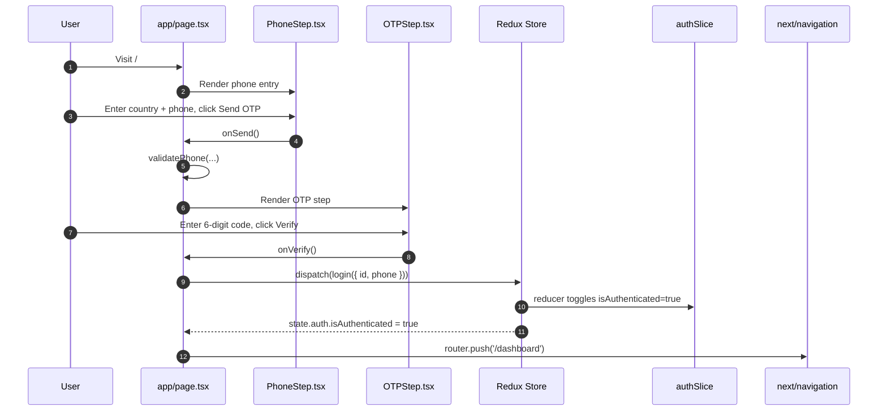
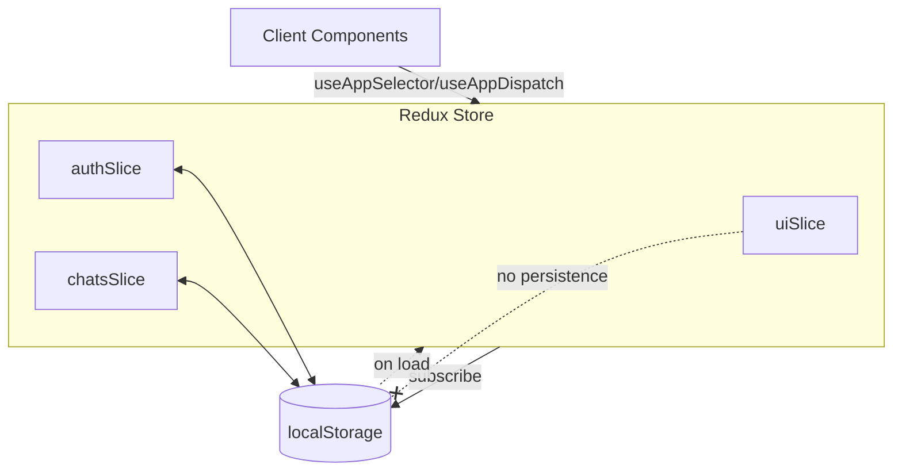

This is a [Next.js](https://nextjs.org) project bootstrapped with [`create-next-app`](https://nextjs.org/docs/app/api-reference/cli/create-next-app).

## Getting Started

First, run the development server:

```bash
npm run dev
# or
yarn dev
# or
pnpm dev
# or
bun dev
```

Open [http://localhost:3000](http://localhost:3000) with your browser to see the result.

You can start editing the page by modifying `app/page.tsx`. The page auto-updates as you edit the file.

This project uses [`next/font`](https://nextjs.org/docs/app/building-your-application/optimizing/fonts) to automatically optimize and load [Geist](https://vercel.com/font), a new font family for Vercel.

## Learn More

To learn more about Next.js, take a look at the following resources:

- [Next.js Documentation](https://nextjs.org/docs) - learn about Next.js features and API.
- [Learn Next.js](https://nextjs.org/learn) - an interactive Next.js tutorial.

You can check out [the Next.js GitHub repository](https://github.com/vercel/next.js) - your feedback and contributions are welcome!

## Deploy on Vercel

The easiest way to deploy your Next.js app is to use the [Vercel Platform](https://vercel.com/new?utm_medium=default-template&filter=next.js&utm_source=create-next-app&utm_campaign=create-next-app-readme) from the creators of Next.js.

Check out our [Next.js deployment documentation](https://nextjs.org/docs/app/building-your-application/deploying) for more details.
# kuvaka-assignment

---
 
# Project Overview
 
A Next.js 15 (App Router) application implementing a simple phone-based login flow with client-side OTP simulation, global state via Redux Toolkit, and UI built with modern React 19 and Radix UI utilities.
 
- Auth flow: User enters phone, requests OTP, verifies OTP, and is considered authenticated.
- State management: `@reduxjs/toolkit` with slices for `auth`, `chats`, and `ui` stored in a single Redux store (`src/store/index.ts`).
- Persistence: `auth` and `chats` slices are persisted to `localStorage` on the client.
- Navigation: After login, user is redirected to `/dashboard`.
 
 
## Tech Stack
 
- Next.js 15 (App Router)
- React 19
- Redux Toolkit + React-Redux
- TypeScript
- Framer Motion, Sonner (toasts)
- Radix UI primitives
- Tailwind CSS (v4)
 
 
## Getting Started
 
1. Install dependencies:
 
```bash
npm install
```
 
2. Run the development server:
 
```bash
npm run dev
# open http://localhost:3000
```
 
3. Build and run production:
 
```bash
npm run build
npm start
```
 
4. Lint:
 
```bash
npm run lint
```
 
 
## Project Structure
 
```text
my-next-app/
├─ src/
│  ├─ app/
│  │  └─ page.tsx                 # Login page (client component)
│  ├─ components/
│  │  ├─ auth/
│  │  │  ├─ Header.tsx            # Auth screen header
│  │  │  ├─ PhoneStep.tsx         # Phone entry step
│  │  │  └─ OTPStep.tsx           # OTP entry step
│  │  └─ redux-provider.tsx       # Wraps the app with Redux Provider
│  ├─ store/
│  │  ├─ index.ts                 # Redux store, persistence to localStorage
│  │  ├─ hooks.ts                 # Typed hooks (useAppDispatch/useAppSelector)
│  │  └─ slices/
│  │     ├─ authSlice.ts          # Auth state & actions (login/logout)
│  │     ├─ chatsSlice.ts         # Chats/messages state & actions
│  │     └─ uiSlice.ts            # UI state & actions
│  ├─ lib/
│  │  └─ phone-validation.ts      # Phone validation helper
│  └─ types/
│     └─ country.ts               # Country type used by PhoneStep
└─ package.json
```
 
 
## Architecture and Data Flow
 
### High-level application wiring
 
- The app is rendered with a Redux Provider defined in `src/components/redux-provider.tsx`, which provides the `store` from `src/store/index.ts` to all client components.
- `src/app/page.tsx` is a client component handling the login UI and interactions.
- `authSlice.ts` stores `isAuthenticated` and `user` info. On login, `login` action sets these fields.
- `chatsSlice.ts` seeds some demo chats and messages and provides actions to create/delete chats and add messages.
- `uiSlice.ts` stores small UI flags (drawer, search, history toggles).
- `src/store/index.ts` persists `auth` and `chats` into `localStorage` on each store update (client-only safeguards).
 
 
### Component and Store Interaction (Mermaid)
 

 
 
### Redux Store and Persistence (Mermaid)
 

 
- In `src/store/index.ts`, `preloadedState` is constructed client-side by reading `localStorage`.
- A guarded `store.subscribe` persists `auth` and `chats` back to `localStorage` on each state change.
 
 
## Key Files Explained
 
- `src/components/redux-provider.tsx` — Wraps children with `<Provider store={store}>` so the Redux store is available app-wide.
- `src/store/index.ts` — Creates the Redux store using `configureStore`. Handles client-only preloading and persistence of `auth` and `chats`.
- `src/store/hooks.ts` — Typed hooks `useAppDispatch` and `useAppSelector` using `RootState` and `AppDispatch` from the store.
- `src/store/slices/authSlice.ts` — Auth reducer and actions: `login`, `logout`.
- `src/store/slices/chatsSlice.ts` — Demo data plus `createChat`, `deleteChat`, `addMessage`.
- `src/store/slices/uiSlice.ts` — UI flags and actions for controlling small UI states.
- `src/app/page.tsx` — Login screen with animated step transitions, country fetch, validation, and dispatch to Redux.
 
 
## Common Tasks
 
- Add a new slice:
  1) Create `src/store/slices/newSlice.ts` with `createSlice`.
  2) Register it in the store's reducer map in `src/store/index.ts`.
  3) Export actions/selectors and use via `useAppDispatch` and `useAppSelector`.
 
- Use Redux in components:
 
```ts
import { useAppDispatch, useAppSelector } from '@/store/hooks';
import { someAction } from '@/store/slices/someSlice';
 
const value = useAppSelector((s) => s.some.value);
const dispatch = useAppDispatch();
dispatch(someAction(payload));
```
 
 
## Notes on TypeScript and Redux Toolkit
 
- Prefer reducers map syntax in `configureStore({ reducer: { ... } })` or combine with `combineReducers` to keep types explicit.
- Persist only serializable state. Avoid storing functions or complex classes in slices.
- Guard all `localStorage` access with `typeof window !== 'undefined'`.
 
 
## License
 
This project is for assignment/demo purposes.
